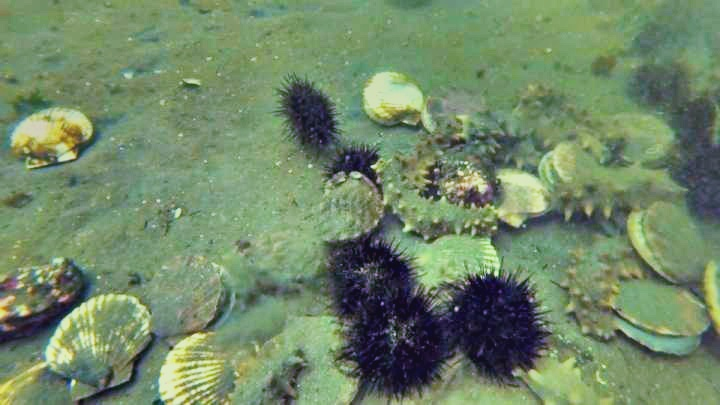
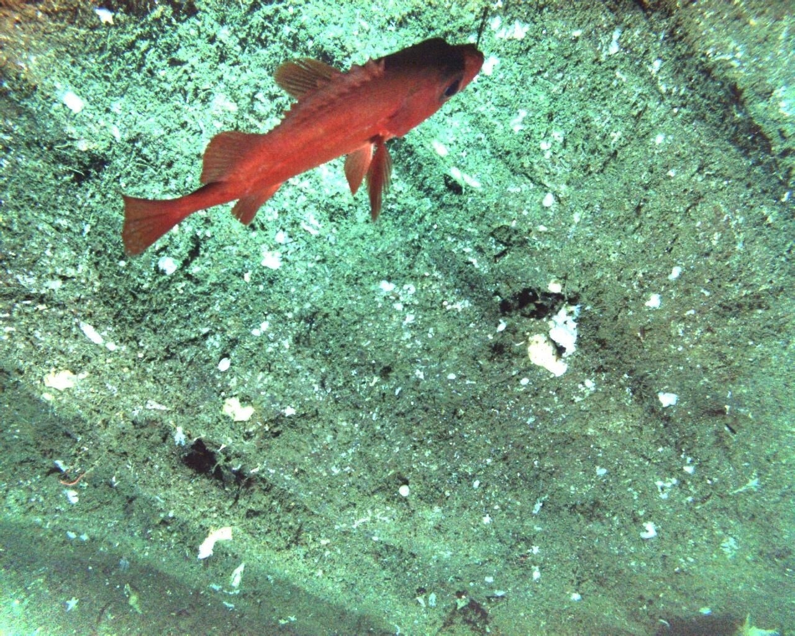
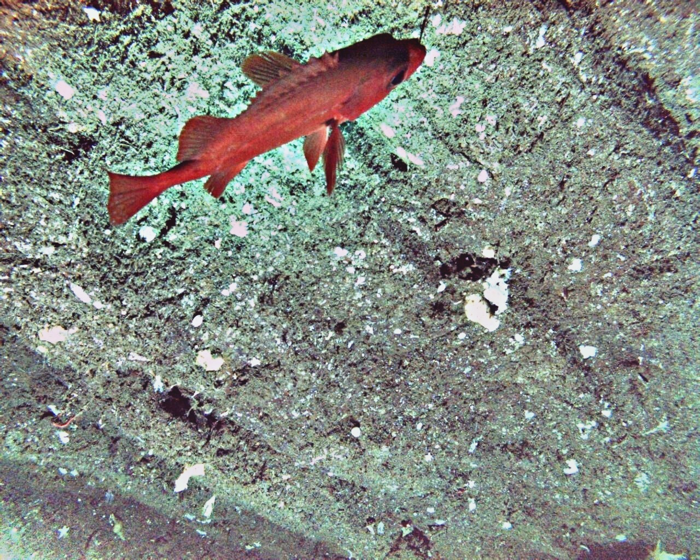

# Underwater-Image-Enhancement
This is a python implementation of some underwater image enhancement algorithms, including CLAHE, MSRCR CLAHE_mix and my proposed method——MSRCR+CLAHE.


## Requirements
- OpenCV
- Numpy
- matplotlib
- natsort

## Run
Before running, you should set the path to get your input images and save the output images in the main.py file. Espacially, you should check the output path is exist or not. Then, you can run the main.py file to get the results.
You can check the parameters by
```bash
python main.py --help
```
The only parameters is the name of the algorithm to use. For example, if you want to use MSRCR+CLAHE, you can run
```bash
python main.py MSRCR_CLAHE
```


## Results
<div class="table-container" style="text-align:center;">
    <table>
        <thead>
        <tr>
            <th>method</th>
            <th>origin</th>
            <th>CLAHE</th>
            <th>CLAHE_mix</th>
            <th>MSRCR</th>
            <th>MSRCR_CLAHE</th>
        </tr>
        </thead>
        <tbody>
        <tr>
            <th>UIQM avg</th>
            <td>2.534</td>
            <td>2.750</td>
            <td>2.659</td>
            <td>2.890</td>
            <th>2.938</th>
        </tr>
        </tbody>
    </table>
    <div class="table-comment">
        <p style="clear:both; font-style:italic; font-size:14px; margin-top:10px;">UIQM for method mentioned before</p>
    </div>
</div>

<head>
    <style>
        .grid-container {
            display: grid;
            grid-template-columns: repeat(4, 1fr);
            gap: 10px;
        }
        .grid-item {
            position: relative;
            overflow: hidden;
        }
        .grid-item img {
            width: 100%;
            height: auto;
            display: block;
        }
    </style>
</head>
<body>
    <div class="grid-container">
        <div class="grid-item">
            
        </div>
        <div class="grid-item">
            
        </div>
        <div class="grid-item">
            
        </div>
        <div class="grid-item">
            
        </div>
        <div class="grid-item">
            
        </div>
        <div class="grid-item">
            
        </div>
        <div class="grid-item">
            
        </div>
        <div class="grid-item">
            
        </div>
        <div class="grid-item">
            
        </div>
        <div class="grid-item">
            
        </div>
        <div class="grid-item">
            
        </div>
        <div class="grid-item">
            
        </div>
        <div class="grid-item">
            
        </div>
        <div class="grid-item">
            
        </div>
        <div class="grid-item">
            
        </div>
        <div class="grid-item">
            
        </div>
    </div>
    <div style="text-align: center;font-style:italic; font-size:14px; margin-top:10px;">
        MSRCR+CLAHE
    </div>
</body>
